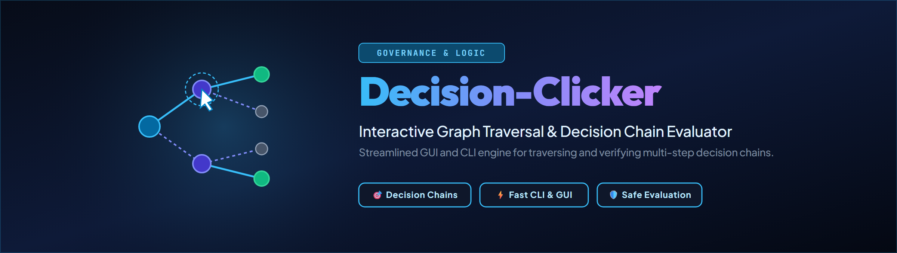

# Decision Clicker

Deutsch · [English](README.md)

Decision Clicker ist eine lokal arbeitende Python-Bibliothek mit CLI und
kleiner Weboberfläche für dateibasierte Entscheidungsketten. Menschen können
Entscheidungen prüfen, festhalten, zurücknehmen und nachvollziehen, ohne die
Quelle der Wahrheit in eine Datenbank zu verschieben.

Die Textdateien der Entscheidungskette bleiben kanonisch. Erzeugte JSON- und
Markdown-Indizes sind jederzeit neu aufbaubare Zwischenspeicher.

## Sicherheitsmodell

- Der Webserver erzwingt eine Loopback-Bindung (`127.0.0.1` oder `localhost`)
  und besitzt keine Authentifizierung für Fernzugriffe.
- Schreibende HTTP-Anfragen prüfen lokalen Host und Browser-Origin. Schreibende
  JSON-Anfragen benötigen zusätzlich `X-Decision-Clicker: 1`.
- Ein laufender Prozess serialisiert seine Schreibtransaktionen. Mehrere
  Decision-Clicker-Prozesse dürfen nicht dieselbe Kette bearbeiten.
- Vor jedem Schreibzugriff werden fremde `LOCK*.txt`-Dateien geprüft; bei einem
  Treffer wird abgebrochen.
- Vor einer Änderung legt der Writer eine bytegenaue Sicherung an.
- Ein Entscheidungsfeld wird nur geändert, solange es noch einen Platzhalter
  enthält.
- Rückgängig ist nur für Entscheidungen möglich, die Decision Clicker
  nachweislich selbst geschrieben hat.
- Entscheidungsbelege bleiben append-only; Rückgängig ergänzt einen
  Rücksetzvermerk, statt den ursprünglichen Beleg zu löschen.
- Skalare Eintragsfelder lehnen Zeilenumbrüche ab; freier Kontext wird als
  parserfester Zitatblock gerendert.
- Tests verwenden synthetische Fixtures und greifen nie auf persönliche
  Entscheidungsdaten zu.

## Voraussetzungen

- Python 3.10 bis 3.13.
- Ein Ordner mit der Entscheidungskette und folgenden Bestandteilen:
  - mindestens eine Datei `TO-DECIDE-USER*.txt`;
  - `DECIDED-AND-DONE.md`;
  - `_tools/decisions_index.py` mit dem Parser-Vertrag `decisions.index/1`.

Der Indexparser bleibt bewusst extern. Decision Clicker lädt genau diesen
Parser, statt einen zweiten, schleichend abweichenden Parser zu pflegen.

## Installation

```bash
python -m venv .venv
python -m pip install -e ".[dev]"
```

Für die reine Laufzeitinstallation genügt:

```bash
python -m pip install .
```

## Konfiguration

`DECISION_CLICKER_CHAIN` ist die empfohlene, eindeutige Konfiguration:

```powershell
$env:DECISION_CLICKER_CHAIN = "D:\data\_DECISIONS"
decision-clicker --check
```

```bash
export DECISION_CLICKER_CHAIN="$HOME/data/_DECISIONS"
decision-clicker --check
```

| Variable | Zweck | Standardwert |
| --- | --- | --- |
| `DECISION_CLICKER_CHAIN` | Kanonischer Ordner der Entscheidungskette | Aus der lokalen OneDrive-Wurzel abgeleitet |
| `DECISION_CLICKER_INBOX` | Optionales Alt-Postfach; mehrere Pfade verwenden den Pfadtrenner des Betriebssystems | `<OneDrive>/Desktop/TO-DECIDE-USER.txt` |
| `DECISION_CLICKER_HOST` | Bind-Adresse der Mini-Oberfläche; nur Loopback | `127.0.0.1` |
| `DECISION_CLICKER_PORT` | Port der Mini-Oberfläche | `8096` |

Unter Windows werden die OneDrive-Umgebungsvariablen erkannt. Neutrale
Rückfallpfade sind `~/OneDrive` und
`~/Library/CloudStorage/OneDrive-Personal`. Bei anderen OneDrive-Ablagen unter
macOS muss `DECISION_CLICKER_CHAIN` ausdrücklich gesetzt werden.

## Nutzung

Kette prüfen, ohne einen Server zu starten:

```bash
decision-clicker --check
```

Lokale Mini-Oberfläche starten:

```bash
decision-clicker --open
```

Unter Windows führt `START.bat` denselben lokalen Start aus und verhindert eine
zweite Instanz auf Port 8096.

Entscheidung anlegen:

```bash
decision-clicker add "Rollout wählen" \
  --frage "Welcher Rollout soll verwendet werden?" \
  --option "A — gestuft" \
  --option "B — sofort" \
  --empfehlung "A — leichter rückgängig zu machen" \
  --dry-run
```

Nach Prüfung des gerenderten Eintrags kann `--dry-run` entfernt werden.

## Schnittstellen

| Schnittstelle | Rolle |
| --- | --- |
| `decision_clicker.api.DecisionClicker` | Oberflächenunabhängige Fassade für Integrationen |
| `decision-clicker` | CLI für Prüfung, Anlage, Postfachübernahme und lokalen Server |
| Mini-Oberfläche auf Port 8096 | Schlanke Rückfalloberfläche nur mit der Python-Standardbibliothek |
| Unified-GUI-Adapter | Optionale reguläre Oberfläche; nutzt dieselbe Fassade und denselben Writer |

Die Mini-Oberfläche umfasst Übersicht, einzelnes Durchklicken, Verlauf und
Rückgängig, Anlage sowie ein dedupliziertes Register. JSON-Endpunkte stellen
Status, Index, Verlauf, Anlage, Entscheidung, Rückgängig und Postfachübernahme
für lokale Automationen bereit.
Schreibende JSON-Aufrufe müssen den ausdrücklichen lokalen API-Schutzheader
senden:

```bash
curl -H "Content-Type: application/json" \
  -H "X-Decision-Clicker: 1" \
  --data '{"title":"Rollout wählen"}' \
  http://127.0.0.1:8096/api/new
```

## Schreibsemantik

Bei einem Entscheidungsklick führt der Writer folgende Schritte aus:

1. fremde Sperren ablehnen;
2. prüfen, ob die indizierte Zeile weiterhin zur erwarteten Entscheidungs-ID
   gehört;
3. Sicherung unter `_decision-archive/_bak/` anlegen;
4. nur `ENTSCHEIDUNG DES USERS:` füllen und einen datierten Werkzeugvermerk
   ergänzen;
5. den Beleg an `DECIDED-AND-DONE.md` anhängen;
6. die abgeleiteten Indexartefakte erneuern.

Das Werkzeug bestätigt niemals die Umsetzung. Eine Entscheidung bleibt in der
aktiven Kette, bis der umgebende Governance-Prozess die Umsetzung verifiziert.

## Übernahme aus einem Alt-Postfach

Das optionale Postfach ist ein Kompatibilitätsweg und keine zweite Quelle der
Wahrheit. Decision Clicker erkennt reguläre Überschriften sowie die Altform
`ID: D-…`. Die Übernahme bewahrt IDs und Originalwortlaut, ergänzt im Postfach
einen Übernahmevermerk und ist idempotent.

## Entwicklung

```bash
python -m ruff check .
python -m pytest -q
python -m build
```

Die Tests prüfen Parser-Anbindung, Konfiguration, Sperrverhalten,
byteerhaltende Schreibzugriffe, Sicherungen, ID-Vergabe, Schutz vor
Strukturinjektion, alle Anlagewege, HTTP-Origin-/Host-Prüfungen, parallele
Anfragen, Postfachübernahme, Verlauf und byteidentische
Entscheidung/Rückgängig-Rundläufe. Die CI führt sie unter Linux, macOS und
Windows mit jeder unterstützten Python-Version aus.

## Grenzen

- Decision Clicker hält Nutzerentscheidungen fest; er entscheidet nicht für
  den Nutzer und sagt keine Antworten voraus.
- Er verifiziert keine Umsetzung und verschiebt keine Einträge in einen
  abgeschlossenen Zustand.
- Er besitzt weder den Parser der Entscheidungskette noch die optionale Unified
  GUI.
- Es gibt keine Telemetrie und keine Laufzeitabhängigkeit außerhalb der
  Python-Standardbibliothek.
- Er ist als optionales strukturelles Untermodul von
  [`policy-registry`](https://github.com/ellmos-ai/policy-registry)
  registriert (siehe `ellmos-module.v2.json`): Beide Werkzeuge beziehen sich
  auf dieselbe `_DECISIONS`-Kette auf der Platte — policy-registry als
  Pointer-/Index-Leser, dieses Werkzeug als Schreiber. Die Beziehung ist rein
  datenseitig; keines importiert das andere, und dieses Werkzeug bleibt
  weiterhin eigenständig und manuell startbar.

Vor Betrieb oder Mitarbeit bitte [SECURITY.md](SECURITY.md),
[PRIVACY.md](PRIVACY.md) und [CONTRIBUTING.md](CONTRIBUTING.md) lesen.

## Lizenz

Projekteigener Code, Dokumentation und eigene Assets stehen unter der
MIT-Lizenz. Siehe [LICENSE](LICENSE). Drittbestandteile und ihre Hinweise sind
in [THIRD_PARTY.md](THIRD_PARTY.md) aufgeführt.
