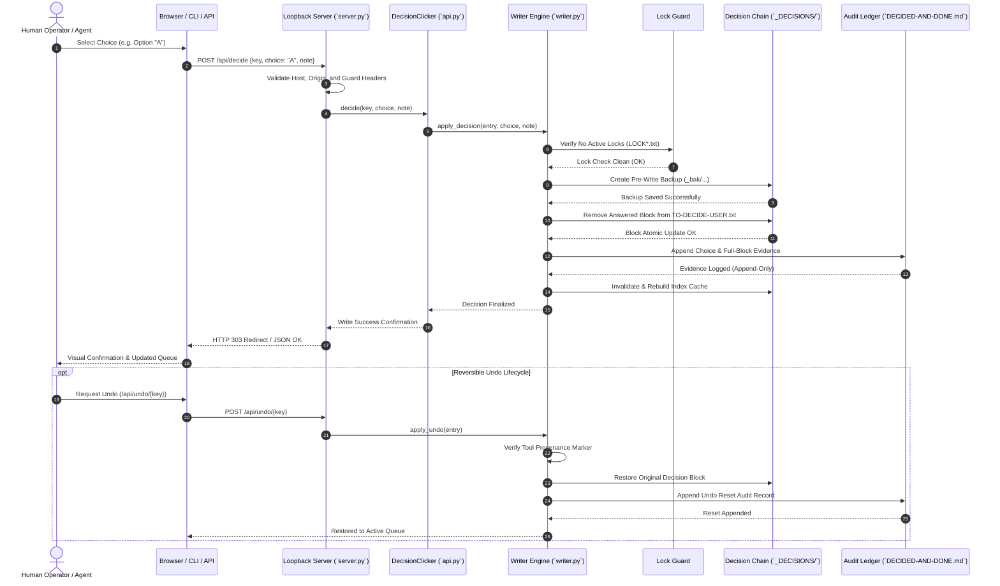

# Decision Clicker

[English](README.md) · [Deutsch](README_de.md)

[](pyproject.toml)
[](.github/workflows/ci.yml)
[](tests/)
[](pyproject.toml)
[](pyproject.toml)
[](SECURITY.md)
[](SECURITY.md)
[](SECURITY.md)
[](THIRD_PARTY_LICENSES.md)
[](MARKETING-LOG.txt)
[](pyproject.toml)
[](https://github.com/ellmos-ai)
[](https://github.com/open-bricks)
[](llms.txt)
[](CHANGELOG.md)
[](LICENSE)

Decision Clicker is a local-first Python library, CLI tool, and lightweight web UI for file-based human-in-the-loop decision chains. It provides human operators and autonomous agent fleets with a bulletproof, deterministic workflow to queue, review, record, audit, and reversibly undo governance decisions without moving the source of truth into an external database.

The markdown and plain-text chain files (`TO-DECIDE-USER.txt` and `DECIDED-AND-DONE.md`) remain the single, canonical source of truth. All generated JSON and Markdown indexes are strictly disposable, rebuildable caches.

---

## Quick Navigation

1. [Architecture & Design](#1-architecture--design)
2. [Governance & Runtime Invariants](#2-governance--runtime-invariants)
3. [Execution & Decision Lifecycle](#3-execution--decision-lifecycle)
4. [Safety Model & Security Policy](#4-safety-model--security-policy)
5. [Requirements & Platform Compatibility](#5-requirements--platform-compatibility)
6. [Installation & Setup](#6-installation--setup)
7. [Configuration & Environment](#7-configuration--environment)
8. [CLI Usage & Commands](#8-cli-usage--commands)
9. [HTTP Mini Server & Web UI](#9-http-mini-server--web-ui)
10. [Python Library API](#10-python-library-api)
11. [Sibling Ecosystem & Partner Matrix](#11-sibling-ecosystem--partner-matrix)
12. [Third-Party Licenses & Transparency](#12-third-party-licenses--transparency)
13. [Verification & Validation Gates](#13-verification--validation-gates)
14. [Machine-Readable LLM Context](#14-machine-readable-llm-context)
15. [Contributing & License](#15-contributing--license)

---

## 1. Architecture & Design

Decision Clicker follows a strict 4-tier local-first architecture designed to guarantee absolute data safety, process isolation, and cross-platform compatibility.

```mermaid
flowchart TD
    subgraph UI_CLI["Client & Automation Surfaces"]
        direction TB
        A1["Human Operator (Web Browser)"]
        A2["CLI Terminal (`decision-clicker`)"]
        A3["Autonomous Agent Fleet (Claude / Gemini / Codex)"]
    end

    subgraph SERVER_TIER["Local HTTP Server & Guards (`server.py`)"]
        direction TB
        B1["Loopback Server (`127.0.0.1:8096`)"]
        B2["Host & Origin Matcher (Anti-CSRF)"]
        B3["`X-Decision-Clicker: 1` Header Gate"]
        B4["Process-Local Write Serializer"]
    end

    subgraph ENGINE_TIER["Core Engine & Integration Seams"]
        direction TB
        C1["`DecisionClicker` API Facade (`api.py`)"]
        C2["Legacy Intake Parser (`intake.py`)"]
        C3["External Index Adapter (`chain.py`)"]
        C4["Guarded Writer Engine (`writer.py`)"]
        C5["Lock Guard (`LOCK*.txt` Fail-Closed)"]
    end

    subgraph STORAGE_TIER["Single Data Canon & Audit Trail"]
        direction TB
        D1[("Active Decision Canon\n`TO-DECIDE-USER.txt`")]
        D2[("Append-Only Ledger\n`DECIDED-AND-DONE.md`")]
        D3[("Byte-Preserving Backups\n`_decision-archive/_bak/`")]
        D4[("Rebuildable Index Caches\n`_tools/decisions_index.py`")]
    end

    A1 -->|"HTTP GET/POST"| B1
    A2 -->|"Direct CLI Commands"| C1
    A3 -->|"REST JSON API"| B1

    B1 --> B2
    B2 --> B3
    B3 --> B4
    B4 --> C1

    C1 --> C2
    C1 --> C3
    C1 --> C4

    C4 --> C5
    C5 -->|"1. Check Locks"| D1
    C4 -->|"2. Pre-Write Backup"| D3
    C4 -->|"3. Atomic Marker Update"| D1
    C4 -->|"4. Record Evidence"| D2
    C4 -->|"5. Refresh Cache"| D4
```

---

## 2. Governance & Runtime Invariants

The runtime integrity of Decision Clicker is governed by 10 non-negotiable invariants:

| Identifier | Principle | Operational Guarantee | Enforcement Mechanism |
|---|---|---|---|
| **INV-LOCAL-01** | **Local-First & Zero-Egress** | Binds exclusively to `127.0.0.1` or `localhost`. Absolutely zero analytics, telemetry, or outbound network traffic. | Network socket bind validation; rejection of non-loopback addresses. |
| **INV-CANON-02** | **Single Data Canon** | Plain text files (`TO-DECIDE-USER.txt`) are the sole source of truth; no SQL/NoSQL database required. | Direct file-system I/O; indexes treated strictly as transient caches. |
| **INV-NOELEV-03** | **Unprivileged Operation** | Operates strictly in user-space (`RunAsInvoker`) without elevation or root permissions. | No privileged system calls or administrative requirements. |
| **INV-ONEDOC-04** | **One-Document Active Contract** | Exactly one active `TO-DECIDE-USER.txt` exists; only open, decision-ready entries are selectable. | Scanner validation in `chain.py` checking the active contract status. |
| **INV-BACKUP-05** | **Byte-Preserving Pre-Write Backup** | Before modifying any chain file, a byte-for-byte timestamped backup is persisted. | `writer.py` backup routine into `_decision-archive/_bak/`. |
| **INV-NOWRITE-06** | **Never Overwrite Decisions** | Existing answered choices can never be overwritten; only placeholder fields can be modified. | Strict validation against placeholder markers prior to mutation. |
| **INV-UNDO-07** | **Reversible Undo with Provenance** | Only decisions provably authored by Decision Clicker can be undone; resets are append-only. | Provenance marker verification; reset entries appended to audit log. |
| **INV-LOCK-08** | **Foreign Lock & Multi-Agent Resilienz** | Halts immediately upon encountering foreign locks (`LOCK*.txt`, `LOCK.user.*`). | Fail-closed lock inspection before acquiring write handles. |
| **INV-CROSS-09** | **Cross-Platform Parity** | 100% deterministic operation across Windows, Linux, and macOS with newline-agnostic parsing. | Universal newline normalization (`\r\n` / `\n`) across tests and I/O. |
| **INV-SLA-10** | **Security Response SLA** | 48-hour response acknowledgment and 5-business-day triage commitment. | Documented security policy in `SECURITY.md` and multi-contact escalation. |

---

## 3. Execution & Decision Lifecycle

The complete lifecycle of reviewing, recording, and reversing a human governance decision is illustrated below:



---

## 4. Safety Model & Security Policy

Decision Clicker is specifically built for sensitive personal and organizational governance workflows:

- **Loopback-Only Binding:** The mini-server enforces binding to `127.0.0.1` or `localhost`. It provides no external authentication because it must never be exposed over LANs, WANs, tunnels, or public reverse proxies.
- **CSRF & Origin Protection:** All mutating requests validate matching `Host` and `Origin` headers. Cross-site Fetch Metadata is rejected immediately.
- **Local Automation Token:** Programmatic JSON writes require `X-Decision-Clicker: 1` to prevent unauthorized browser-scripted writes.
- **Fail-Closed Foreign Locks:** Writing halts immediately if any `LOCK*.txt` file exists in the chain directory.
- **Atomic Pre-Write Backups:** Backups preserve byte order, character encodings (UTF-8 / UTF-8-SIG), and line endings.
- **Security SLA:** Documented in [SECURITY.md](SECURITY.md) with a 48h acknowledgment and 5-day triage commitment via `security@open-bricks.org` and `security@ellmos.ai`.

---

## 5. Requirements & Platform Compatibility

- **Python:** `3.10`, `3.11`, `3.12`, `3.13`.
- **Platforms:** Microsoft Windows, Linux (Ubuntu/Debian/Fedora/Arch), Apple macOS.
- **External Dependencies:** **Zero**. Relies exclusively on the Python standard library.
- **Decision Chain Structure:**
  - Exactly one active `TO-DECIDE-USER.txt` file;
  - An append-only `DECIDED-AND-DONE.md` ledger;
  - `_tools/decisions_index.py` conforming to the canonical `decisions.index/1` parser contract.

---

## 6. Installation & Setup

### Development Installation (with test suite & linter)

```bash
git clone https://github.com/ellmos-ai/decision-clicker.git
cd decision-clicker
python -m venv .venv

# On Windows:
.venv\Scripts\activate
# On Linux / macOS:
source .venv/bin/activate

python -m pip install -e ".[dev]"
```

### Production / Runtime Installation

```bash
python -m pip install .
```

---

## 7. Configuration & Environment

Configuration is resolved through environment variables with intelligent automatic fallbacks:

```powershell
# Windows PowerShell
$env:DECISION_CLICKER_CHAIN = "C:\Users\<User>\OneDrive\.TOPICS\_control-center\_DECISIONS"
decision-clicker --check
```

```bash
# Linux / macOS POSIX Shell
export DECISION_CLICKER_CHAIN="$HOME/OneDrive/.TOPICS/_control-center/_DECISIONS"
decision-clicker --check
```

| Environment Variable | Description | Default Resolution |
|---|---|---|
| `DECISION_CLICKER_CHAIN` | Path to the canonical decision-chain directory | Auto-discovered from local OneDrive roots (`OneDrive`, `OneDrive-Personal`) |
| `DECISION_CLICKER_INBOX` | Optional legacy desktop intake postbox | `<OneDrive>/Desktop/TO-DECIDE-USER.txt` |
| `DECISION_CLICKER_HOST` | Loopback bind address for HTTP mini-UI | `127.0.0.1` |
| `DECISION_CLICKER_PORT` | Port for the HTTP mini-UI | `8096` |

---

## 8. CLI Usage & Commands

### Health & Chain Check

```bash
decision-clicker --check
```

Inspects chain integrity, active contract adherence, parser compatibility, and reports active vs decided counts.

### Launch Mini Web UI

```bash
decision-clicker --open
```

Binds to `127.0.0.1:8096` and opens your default browser. On Windows, `START.bat` wraps this command safely.

### Add a New Decision to the Chain

```bash
decision-clicker add "Rollout Strategy Selection" \
  --frage "Which deployment pattern should be used for v1.1.1?" \
  --option "A — Blue/Green with immediate traffic switch" \
  --option "B — Canary staged release over 48 hours" \
  --empfehlung "B — Canary provides automated rollback" \
  --dry-run
```

Remove `--dry-run` to append the entry directly to `TO-DECIDE-USER.txt`.

### Intake Legacy Inbox Decisions

```bash
decision-clicker takeover
```

Scans legacy desktop postboxes (`Desktop/TO-DECIDE-USER.txt`), validates formatting, and imports entries idempotently into the canonical chain.

---

## 9. HTTP Mini Server & Web UI

The mini-server operates on `http://127.0.0.1:8096`:

| Route | Method | Description | Guard / Headers |
|---|---|---|---|
| `/` | `GET` | Overview of active decisions and summary counts | None |
| `/klick` | `GET` | Focused single-decision review and click card | None |
| `/verlauf` | `GET` | Audit trail and history of decided items | None |
| `/neu` | `GET`, `POST` | Decision creation form | Host & Origin check |
| `/api/index` | `GET` | Machine-readable JSON index of the decision chain | None |
| `/api/new` | `POST` | Submit an **open proposal** (the only JSON write path) | `X-Decision-Clicker: 1` + Host & Origin |
| `/api/decide` | `POST` | Record a decision choice | Human HTML UI only — JSON rejected; single-use confirmation |
| `/api/intake` | `POST` | Trigger legacy inbox intake | Human HTML UI only — JSON rejected; single-use confirmation |
| `/api/undo/<key>` | `POST` | Reversibly undo a previously recorded decision | Human HTML UI only — JSON rejected; single-use confirmation |

`/api/decide`, `/api/intake` and `/api/undo/*` reject `Content-Type:
application/json` even with the guard header — they require an explicit action
in the HTML UI. Those forms carry a five-minute, single-use confirmation bound
to server instance, action and record, so merely changing a request's content
type does not cross the human-UI boundary.

Programmatic local automation may therefore only **propose**:

```bash
curl -X POST http://127.0.0.1:8096/api/new \
  -H "Content-Type: application/json" \
  -H "X-Decision-Clicker: 1" \
  -d '{"frage": "Ship 1.2.0?", "optionen": ["A: yes", "B: wait"]}'
```

A submitted candidate is always rendered as `STATUS: OFFEN` with an unanswered
user field; supplied `status`, `decision` or `implemented` properties have no
effect. AI, memory and policy adapters receive
`decision_clicker.api.ProposalSubmitter`, not the human `DecisionClicker`
mutation facade.

Optional evidence metadata uses these single-line fields: `EVIDENZANKER`,
`GEGENBELEGE`, `FEHLENDE INFORMATIONEN`, `ERSTELLT VON` and
`KONTEXT-FINGERPRINT`. Multiple values are joined with ` | `; a fingerprint has
the form `sha256:` plus 64 hex characters. They improve provenance lookup but
never certify truth.

---

## 10. Python Library API

Decision Clicker can be embedded directly into custom Python tools or agent control pipelines:

```python
from pathlib import Path
from decision_clicker.api import DecisionClicker

# Initialize facade pointing to the canonical chain directory
clicker = DecisionClicker(Path("C:/_Local_DEV/chains/_DECISIONS"))

# 1. Inspect open decisions
open_items = clicker.open_decisions()
print(f"Pending decisions: {len(open_items)}")

for item in open_items:
    print(f"[{item['id']}] {item['title']}")
    for opt in item.get("options", []):
        print(f"  - Option {opt['letter']}: {opt['text']}")

# 2. Record a human choice
if open_items:
    target = open_items[0]
    clicker.decide(
        key=target["key"],
        choice="A",
        note="Selected during automated system validation."
    )
    print(f"Decision recorded for {target['id']}.")

# 3. Reversibly undo if required
# clicker.undo(target["key"])
```

---

## 11. Sibling Ecosystem & Partner Matrix

Decision Clicker operates within the open-bricks and ellmos-ai ecosystems, coordinating with 16 sibling repositories:

| Repository | Organization | Category | Integration Role with Decision Clicker |
|---|---|---|---|
| [`policy-registry`](https://github.com/ellmos-ai/policy-registry) | `ellmos-ai` | Governance | **Parent Bundle Seam:** Requires `decision.clicker` capability as its human writer/UI component. |
| [`system-auditor`](https://github.com/ellmos-ai/system-auditor) | `ellmos-ai` | Infrastructure | Audits multi-host runtime states and flags pending decisions. |
| [`assistant-core`](https://github.com/ellmos-ai/assistant-core) | `ellmos-ai` | AI Infrastructure | Async agent fleet core engine producing governance requests. |
| [`store-packager`](https://github.com/ellmos-ai/store-packager) | `ellmos-ai` | Packaging | Packages decision-chain modules into distributable artifacts. |
| [`clip-storyboard-director`](https://github.com/ellmos-ai/clip-storyboard-director) | `ellmos-ai` | Media Automation | Utilizes human decisions for storyboard cut approval. |
| [`sqlite-transit-sync`](https://github.com/ellmos-ai/sqlite-transit-sync) | `ellmos-ai` | Data Sync | Syncs structured governance mirrors across local machines. |
| [`clutch`](https://github.com/ellmos-ai/clutch) | `ellmos-ai` | Supervisor | Manages background decision-server processes. |
| [`ellmos-installer`](https://github.com/ellmos-ai/ellmos-installer) | `ellmos-ai` | Deployment | Automated local installation for decision services. |
| [`app-rotator`](https://github.com/dev-bricks/app-rotator) | `dev-bricks` | Orchestration | Gracefully restarts local server instances on port changes. |
| [`workflowhooker`](https://github.com/dev-bricks/workflowhooker) | `dev-bricks` | Automation | Triggers Git and webhook hooks upon decision finalization. |
| [`ExplorerPro`](https://github.com/file-bricks/ExplorerPro) | `file-bricks` | Desktop Tools | Provides visual desktop file browsing for decision archives. |
| [`CleanMarkdown`](https://github.com/doc-bricks/CleanMarkdown) | `doc-bricks` | Formatting | Lints and formats markdown decision blocks. |
| [`KlangpultLight`](https://github.com/entertain-and-more/KlangpultLight) | `entertain-and-more` | Media Tools | Audio notifications on new decision arrival. |
| [`abc-hct`](https://github.com/research-line/abc-hct) | `research-line` | Open Science | Algorithmic audit analysis of decision latency. |
| [`functional-stability-theory`](https://github.com/research-line/functional-stability-theory) | `research-line` | Mathematics | Mathematical formalization of consensus chains. |
| [`umbrella`](https://github.com/open-bricks) | `open-bricks` | Umbrella Org | Central registry for open-source bricks and standards. |

---

## 12. Third-Party Licenses & Transparency

`decision-clicker` guarantees absolute sovereignty and supply-chain transparency:
- **Zero External Runtime Dependencies**: Relies exclusively on the Python standard library (`http.server`, `urllib.parse`, `json`, `pathlib`, `subprocess`, `argparse`, `dataclasses`, `re`, `shutil`, `typing`) under the Python Software Foundation License (PSFL).
- **100% Permissive Dev Tooling**: Build, linting, and testing dependencies (`pytest`, `ruff`, `build`, `setuptools`) are strictly isolated to development environments and covered under MIT/Apache-2.0 licenses.
- **Maintainer-Authored Media**: Project artwork (`assets/banner.png` / `assets/banner.svg`) is authored by the maintainer and distributed under the MIT license with zero external stock fonts or assets.
- Complete license texts, audit dates, and dependency inventory are maintained in [THIRD_PARTY_LICENSES.md](THIRD_PARTY_LICENSES.md).

---

## 13. Verification & Validation Gates

All modifications undergo strict validation gates prior to release:

| Gate | Tool | Target | Success Criteria |
|---|---|---|---|
| **Syntax & Bytecode** | `python -m compileall` | `src/`, `tests/` | 0 syntax errors, valid bytecode across Python 3.10–3.13. |
| **Linting & Quality** | `ruff check` | Entire repository | 0 linting warnings or style violations. |
| **Unit & Integration** | `pytest` | `tests/` | 156 tests passed (100% green). |
| **Metadata Parity** | `tests/test_metadata.py` | Badges, PEP 621, Invariants | Contract tests pass verifying docs, URLs, and SLAs. |
| **Build & Packaging** | `python -m build` | Source & Wheel dists | Clean build of distributable `.tar.gz` and `.whl`. |

Execute the full suite locally:

```bash
python -m compileall -q src tests
python -m ruff check .
python -m pytest -v
python -m build
```

---

## 14. Machine-Readable LLM Context

Autonomous LLM agents inspecting this repository should read [llms.txt](llms.txt) for machine-optimized code maps, governance invariant definitions, and deployment boundaries. Module manifest details are published in `ellmos-module.v2.json`.

---

## 15. Contributing & License

Contributions are welcome! Please review [CONTRIBUTING.md](CONTRIBUTING.md), [PRIVACY.md](PRIVACY.md), and [SECURITY.md](SECURITY.md) before submitting patches.

Licensed under the **MIT License**. See [LICENSE](LICENSE) for full legal text. Third-party licenses and asset attestations are documented in [THIRD_PARTY_LICENSES.md](THIRD_PARTY_LICENSES.md).
