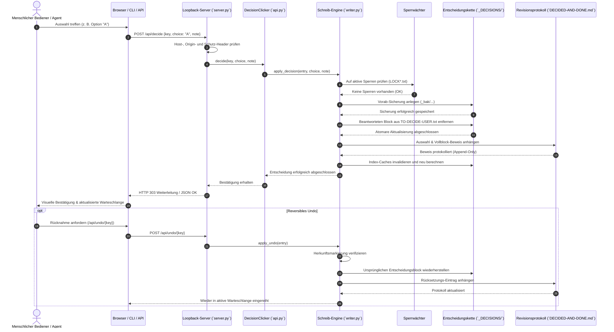

# Decision Clicker

[English](README.md) · [Deutsch](README_de.md)

[](pyproject.toml)
[](.github/workflows/ci.yml)
[](tests/)
[](pyproject.toml)
[](pyproject.toml)
[](SECURITY.md)
[](SECURITY.md)
[](SECURITY.md)
[](pyproject.toml)
[](https://github.com/ellmos-ai)
[](https://github.com/open-bricks)
[](llms.txt)
[](CHANGELOG.md)
[](LICENSE)

Decision Clicker ist eine Local-First Python-Bibliothek, ein CLI-Tool und eine leichtgewichtige Web-Oberfläche für dateibasierte Human-in-the-Loop Entscheidungsketten. Sie bietet menschlichen Bedienern und autonomen Agenten-Flotten einen deterministischen, fehlertoleranten Arbeitsablauf zur Einstellung, Prüfung, Dokumentation, Revision und reversiblen Rücknahme von Governance-Entscheidungen – ohne Notwendigkeit einer zentralen Datenbank.

Die Markdown- und Textdateien (`TO-DECIDE-USER.txt` und `DECIDED-AND-DONE.md`) bleiben der alleinige, kanonische Datenbestand (Source of Truth). Alle generierten JSON- und Markdown-Indexe sind weggreifbare, jederzeit neu berechenbare Caches.

---

## Schnellübersicht

1. [Architektur & Design](#1-architektur--design)
2. [Governance & Laufzeit-Invarianten](#2-governance--laufzeit-invarianten)
3. [Ausführungs- & Entscheidungslebenszyklus](#3-ausführungs--entscheidungslebenszyklus)
4. [Sicherheitsmodell & Richtlinie](#4-sicherheitsmodell--richtlinie)
5. [Systemanforderungen & Plattformen](#5-systemanforderungen--plattformen)
6. [Installation & Einrichtung](#6-installation--einrichtung)
7. [Konfiguration & Umgebungsvariablen](#7-konfiguration--umgebungsvariablen)
8. [CLI-Befehle & Verwendung](#8-cli-befehle--verwendung)
9. [HTTP Mini-Server & Web-UI](#9-http-mini-server--web-ui)
10. [Python-Bibliothek API](#10-python-bibliothek-api)
11. [Ökosystem & Partner-Matrix](#11-ökosystem--partner-matrix)
12. [Verifikation & Qualitäts-Gates](#12-verifikation--qualitäts-gates)
13. [Maschinenlesbarer LLM-Kontext](#13-maschinenlesbarer-llm-kontext)
14. [Beiträge & Lizenz](#14-beiträge--lizenz)

---

## 1. Architektur & Design

Decision Clicker basiert auf einer strikten 4-Schichten Local-First Architektur zur Gewährleistung maximaler Datensicherheit, Prozessisolierung und Plattformunabhängigkeit.

```mermaid
flowchart TD
    subgraph UI_CLI["Bedien- & Automationsebenen"]
        direction TB
        A1["Menschlicher Bediener (Web-Browser)"]
        A2["CLI-Terminal (`decision-clicker`)"]
        A3["Autonome Agenten-Flotte (Claude / Gemini / Codex)"]
    end

    subgraph SERVER_TIER["Lokaler HTTP-Server & Schutzfilter (`server.py`)"]
        direction TB
        B1["Loopback-Server (`127.0.0.1:8096`)"]
        B2["Host- & Origin-Abgleich (Anti-CSRF)"]
        B3["`X-Decision-Clicker: 1` Header-Schutz"]
        B4["Prozesslokale Schreib-Serialisierung"]
    end

    subgraph ENGINE_TIER["Kern-Engine & Integrationsnähte"]
        direction TB
        C1["`DecisionClicker` API-Fassade (`api.py`)"]
        C2["Legacy Intake-Parser (`intake.py`)"]
        C3["Externer Index-Adapter (`chain.py`)"]
        C4["Abgesicherte Schreib-Engine (`writer.py`)"]
        C5["Sperrwächter (`LOCK*.txt` Fail-Closed)"]
    end

    subgraph STORAGE_TIER["Einziger Datenkanon & Revisionsprotokoll"]
        direction TB
        D1[("Aktiver Entscheidungskanon\n`TO-DECIDE-USER.txt`")]
        D2[("Unveränderliches Verlaufsprotokoll\n`DECIDED-AND-DONE.md`")]
        D3[("Byte-getreue Sicherungen\n`_decision-archive/_bak/`")]
        D4[("Neu berechenbare Index-Caches\n`_tools/decisions_index.py`")]
    end

    A1 -->|"HTTP GET/POST"| B1
    A2 -->|"Direkte CLI-Befehle"| C1
    A3 -->|"REST JSON-Schnittstelle"| B1

    B1 --> B2
    B2 --> B3
    B3 --> B4
    B4 --> C1

    C1 --> C2
    C1 --> C3
    C1 --> C4

    C4 --> C5
    C5 -->|"1. Sperren prüfen"| D1
    C4 -->|"2. Vorab-Backup anlegen"| D3
    C4 -->|"3. Atomares Entfernen aus Vorlage"| D1
    C4 -->|"4. Beweisblock anhängen"| D2
    C4 -->|"5. Cache neu aufbauen"| D4
```

---

## 2. Governance & Laufzeit-Invarianten

Die Integrität von Decision Clicker wird durch 10 verbindliche Invarianten gesichert:

| Kennung | Prinzip | Betriebliche Garantie | Durchsetzungsmechanismus |
|---|---|---|---|
| **INV-LOCAL-01** | **Local-First & Zero-Egress** | Bindet ausschließlich an `127.0.0.1` oder `localhost`. Absolut keine Telemetrie oder ausgehender Netzwerkverkehr. | Socket-Bindung; strikte Zurückweisung von Nicht-Loopback-Adressen. |
| **INV-CANON-02** | **Einziger Datenkanon** | Reine Textdateien (`TO-DECIDE-USER.txt`) sind die einzige Wahrheit; keine SQL/NoSQL-Datenbank erforderlich. | Direktes Dateisystem-I/O; Indexdateien fungieren als weggreifbare Caches. |
| **INV-NOELEV-03** | **Unprivilegierter Betrieb** | Arbeitet vollständig im Benutzerkontext (`RunAsInvoker`) ohne Administrator- oder Root-Rechte. | Keine privilegierten Systemaufrufe. |
| **INV-ONEDOC-04** | **Ein-Dokument-Vertrag** | Genau eine aktive `TO-DECIDE-USER.txt` existiert; nur unbeantwortete, entscheidungsreife Einträge sind klickbar. | Scanner-Prüfung in `chain.py` auf Gültigkeit des aktiven Vertrags. |
| **INV-BACKUP-05** | **Byte-getreue Vorab-Sicherung** | Vor jeder Modifikation einer Kettendatei wird eine byte-exakte Sicherung mit Zeitstempel angelegt. | `writer.py` Backup-Routine unter `_decision-archive/_bak/`. |
| **INV-NOWRITE-06** | **Kein Überschreiben** | Bereits beantwortete Entscheidungen dürfen nicht überschrieben werden; nur Platzhalter können gefüllt werden. | Strikte Prüfung auf Platzhalter vor jeder Schreiboperation. |
| **INV-UNDO-07** | **Reversibles Undo mit Nachweis** | Nur Entscheidungen mit nachweislicher Decision-Clicker-Herkunft können zurückgesetzt werden; Protokoll ist append-only. | Herkunftsmarkierungsprüfung; Rücksetzungs-Eintrag im Verlauf. |
| **INV-LOCK-08** | **Resilienz bei Fremdsperren** | Stoppt sofort bei Vorhandensein fremder Sperren (`LOCK*.txt`, `LOCK.user.*`). | Fail-Closed Prüfung vor dem Öffnen von Schreib-Handles. |
| **INV-CROSS-09** | **Plattformparität** | Vollständig deterministisches Verhalten unter Windows, Linux und macOS mit zeilenumbruchstolerantem Parsing. | Universelle Normalisierung von CRLF/LF (`\r\n` / `\n`) in Tests und I/O. |
| **INV-SLA-10** | **Sicherheits-Reaktions-SLA** | 48 Stunden Eingangsbestätigung und 5 Werktage verbindliche Triage-Zusage. | Dokumentiert in `SECURITY.md` mit Multi-Kanal-Eskalation. |

---

## 3. Ausführungs- & Entscheidungslebenszyklus

Der vollständige Ablauf von Anzeige, Auswahl und reversibler Rücknahme einer Governance-Entscheidung:



---

## 4. Sicherheitsmodell & Richtlinie

Decision Clicker wurde speziell für vertrauliche persönliche und unternehmerische Governance-Abläufe konzipiert:

- **Ausschließliche Loopback-Bindung:** Der Miniserver bindet ausschließlich an `127.0.0.1` oder `localhost`. Er enthält keine Benutzer-Authentifizierung und darf niemals über ein LAN, WLAN, VPN, Port-Forwarding oder ungesicherte Reverse-Proxys freigegeben werden.
- **CSRF- & Origin-Schutz:** Mutierende Endpunkte validieren passende `Host`- und `Origin`-Header. Cross-Origin Fetch-Metadaten werden abgewiesen.
- **Lokales Automations-Token:** Programmatische JSON-Anfragen erfordern den Header `X-Decision-Clicker: 1`.
- **Fail-Closed bei Sperren:** Schreiboperationen brechen unverzüglich ab, falls eine `LOCK*.txt`-Datei vorliegt.
- **Byte-erhaltende Sicherungen:** Backups bewahren Byte-Reihenfolge, Zeichenkodierung (UTF-8 / UTF-8-SIG) und Zeilenenden exakt.
- **Sicherheits-SLA:** Verbindlich in [SECURITY.md](SECURITY.md) hinterlegt (48h Erstreaktion, 5 Tage Triage via `security@open-bricks.org` und `security@ellmos.ai`).

---

## 5. Systemanforderungen & Plattformen

- **Python:** `3.10`, `3.11`, `3.12`, `3.13`.
- **Betriebssysteme:** Windows, Linux, macOS.
- **Externe Abhängigkeiten:** **Keine**. Nutzt ausschließlich Module der Python-Standardbibliothek.
- **Verzeichnisstruktur der Entscheidungskette:**
  - Genau eine aktive `TO-DECIDE-USER.txt`-Datei;
  - Eine unveränderliche `DECIDED-AND-DONE.md`-Protokolldatei;
  - Ein `_tools/decisions_index.py`-Skript gemäß Spezifikation `decisions.index/1`.

---

## 6. Installation & Einrichtung

### Entwicklungsumgebung (mit Tests & Linter)

```bash
git clone https://github.com/ellmos-ai/decision-clicker.git
cd decision-clicker
python -m venv .venv

# Unter Windows:
.venv\Scripts\activate
# Unter Linux / macOS:
source .venv/bin/activate

python -m pip install -e ".[dev]"
```

### Produktions- / Laufzeitinstallation

```bash
python -m pip install .
```

---

## 7. Konfiguration & Umgebungsvariablen

Die Konfiguration erfolgt über Umgebungsvariablen mit automatischer Pfadfindung:

```powershell
# Windows PowerShell
$env:DECISION_CLICKER_CHAIN = "C:\Users\<User>\OneDrive\.TOPICS\_control-center\_DECISIONS"
decision-clicker --check
```

```bash
# Linux / macOS POSIX-Shell
export DECISION_CLICKER_CHAIN="$HOME/OneDrive/.TOPICS/_control-center/_DECISIONS"
decision-clicker --check
```

| Umgebungsvariable | Beschreibung | Standardwert |
|---|---|---|
| `DECISION_CLICKER_CHAIN` | Pfad zum kanonischen Entscheidungsketten-Ordner | Automatisch ermittelt aus lokalem OneDrive-Stamm |
| `DECISION_CLICKER_INBOX` | Optionaler Pfad zum Desktop-Postfach | `<OneDrive>/Desktop/TO-DECIDE-USER.txt` |
| `DECISION_CLICKER_HOST` | Loopback-Bind-Adresse für den Miniserver | `127.0.0.1` |
| `DECISION_CLICKER_PORT` | Port für den Miniserver | `8096` |

---

## 8. CLI-Befehle & Verwendung

### Prüfung der Kette ohne Serverstart

```bash
decision-clicker --check
```

Prüft die Gültigkeit der Kette, Einhaltung des aktiven Vertrags und gibt eine Zählung offener und abgeschlossener Entscheidungen aus.

### Lokale Web-Oberfläche starten

```bash
decision-clicker --open
```

Startet den Miniserver auf `127.0.0.1:8096` und öffnet die UI im Standard-Browser. Unter Windows bietet `START.bat` einen doppelklickbaren Schnellstart.

### Neue Entscheidung einstellen

```bash
decision-clicker add "Auswahl der Rollout-Strategie" \
  --frage "Welches Rollout-Muster soll für v1.1.0 verwendet werden?" \
  --option "A — Blue/Green mit sofortiger Verkehrsumschaltung" \
  --option "B — Canary-Rollout gestaffelt über 48 Stunden" \
  --empfehlung "B — Canary ermöglicht automatischen Rollback" \
  --dry-run
```

Entfernen Sie `--dry-run`, um den Eintrag direkt in `TO-DECIDE-USER.txt` einzufügen.

### Postfach-Einträge übernehmen (Takeover)

```bash
decision-clicker takeover
```

Liest Einträge aus dem Desktop-Postfach ein und überführt sie idempotent in die kanonische Kette.

---

## 9. HTTP Mini-Server & Web-UI

Übersicht über die bereitgestellten Endpunkte:

| Route | Methode | Funktion | Schutz / Header |
|---|---|---|---|
| `/` | `GET` | Übersicht aller offenen Entscheidungen | Keine |
| `/klick` | `GET` | Einzelansicht zum Durchklicken | Keine |
| `/verlauf` | `GET` | Revisionshistorie bereits getroffener Entscheidungen | Keine |
| `/neu` | `GET`, `POST` | Formular zur Erstellung neuer Entscheidungen | Host- & Origin-Prüfung |
| `/api/index` | `GET` | Maschinenlesbarer JSON-Index | Keine |
| `/api/decide` | `POST` | Entscheidung speichern | `X-Decision-Clicker: 1` oder Origin |
| `/api/undo/<key>` | `POST` | Entscheidung reversibel zurücksetzen | `X-Decision-Clicker: 1` oder Origin |
| `/api/takeover` | `POST` | Postfach-Import anstoßen | `X-Decision-Clicker: 1` oder Origin |

Automationsbeispiel via cURL:

```bash
curl -X POST http://127.0.0.1:8096/api/decide \
  -H "Content-Type: application/json" \
  -H "X-Decision-Clicker: 1" \
  -d '{"key": "D-20260909-01", "choice": "B", "note": "Über automatisierten Agenten bestätigt"}'
```

---

## 10. Python-Bibliothek API

Integration direkt in eigene Skripte oder Agent-Workflows:

```python
from pathlib import Path
from decision_clicker.api import DecisionClicker

clicker = DecisionClicker(Path("C:/_Local_DEV/chains/_DECISIONS"))

# 1. Offene Entscheidungen abrufen
offene = clicker.open_decisions()
print(f"Offene Entscheidungen: {len(offene)}")

for item in offene:
    print(f"[{item['id']}] {item['title']}")
    for opt in item.get("options", []):
        print(f"  - Option {opt['letter']}: {opt['text']}")

# 2. Entscheidung fällen
if offene:
    ziel = offene[0]
    clicker.decide(
        key=ziel["key"],
        choice="A",
        note="Ausgewählt während der Systemvalidierung."
    )
    print(f"Entscheidung für {ziel['id']} dokumentiert.")

# 3. Bei Bedarf zurücksetzen
# clicker.undo(ziel["key"])
```

---

## 11. Ökosystem & Partner-Matrix

Decision Clicker ist in das Open-Bricks- und Ellmos-AI-Ökosystem eingebettet und kooperiert mit 16 Partner-Repositories:

| Repository | Organisation | Bereich | Rolle im Zusammenspiel |
|---|---|---|---|
| [`policy-registry`](https://github.com/ellmos-ai/policy-registry) | `ellmos-ai` | Governance | **Übergeordnetes Bundle:** Benötigt `decision.clicker` als Schreib-/UI-Komponente. |
| [`system-auditor`](https://github.com/ellmos-ai/system-auditor) | `ellmos-ai` | Infrastruktur | Prüft Systemzustände und meldet ausstehende Entscheidungen. |
| [`assistant-core`](https://github.com/ellmos-ai/assistant-core) | `ellmos-ai` | KI-Infrastruktur | Asynchrone Agenten-Engine, die Entscheidungsanfragen erzeugt. |
| [`store-packager`](https://github.com/ellmos-ai/store-packager) | `ellmos-ai` | Paketierung | Bündelt Module und Konfigurationen in Auslieferungspakete. |
| [`clip-storyboard-director`](https://github.com/ellmos-ai/clip-storyboard-director) | `ellmos-ai` | Medienautomation | Nutzt Entscheidungen zur manuellen Freigabe von Schnittfolgen. |
| [`sqlite-transit-sync`](https://github.com/ellmos-ai/sqlite-transit-sync) | `ellmos-ai` | Datensynchronisation | Gleicht Revisionsstände zwischen lokalen Arbeitsstationen ab. |
| [`clutch`](https://github.com/ellmos-ai/clutch) | `ellmos-ai` | Prozessverwaltung | Verwaltet und überwacht Server-Hintergrundprozesse. |
| [`ellmos-installer`](https://github.com/ellmos-ai/ellmos-installer) | `ellmos-ai` | Bereitstellung | Automatisierte Installation lokaler Steuerungsdienste. |
| [`app-rotator`](https://github.com/dev-bricks/app-rotator) | `dev-bricks` | Orchestrierung | Ermöglicht unterbrechungsfreie Serverstarts bei Portwechseln. |
| [`workflowhooker`](https://github.com/dev-bricks/workflowhooker) | `dev-bricks` | Automation | Löst Webhooks und Git-Aktionen nach getroffener Entscheidung aus. |
| [`ExplorerPro`](https://github.com/file-bricks/ExplorerPro) | `file-bricks` | Desktop-Tools | Grafischer Datei-Explorer für Entscheidungsarchive. |
| [`CleanMarkdown`](https://github.com/doc-bricks/CleanMarkdown) | `doc-bricks` | Textverarbeitung | Bereinigt und formatiert Markdown-Entscheidungsblöcke. |
| [`KlangpultLight`](https://github.com/entertain-and-more/KlangpultLight) | `entertain-and-more` | Audio-Tools | Akustische Signalisierung neuer Entscheidungsanfragen. |
| [`abc-hct`](https://github.com/research-line/abc-hct) | `research-line` | Wissenschaft | Algorithmische Analyse von Reaktionszeiten in Entscheidungsketten. |
| [`functional-stability-theory`](https://github.com/research-line/functional-stability-theory) | `research-line` | Mathematik | Mathematische Stabilitätsanalyse konsistenter Ketten. |
| [`umbrella`](https://github.com/open-bricks) | `open-bricks` | Dachorganisation | Zentrales Verzeichnis freier Komponenten und Standards. |

---

## 12. Verifikation & Qualitäts-Gates

Vor jedem Release durchläuft Decision Clicker strenge Prüfungen:

| Gate | Werkzeug | Ziel | Kriterium |
|---|---|---|---|
| **Syntax & Bytecode** | `python -m compileall` | `src/`, `tests/` | 0 Syntaxfehler unter Python 3.10–3.13. |
| **Linting & Stil** | `ruff check` | Gesamtes Repository | 0 Warnungen, vollständige PEP 8 Konformität. |
| **Unit & Integration** | `pytest` | `tests/` | 138+ bestandene Tests (100% grün). |
| **Metadaten-Parität** | `tests/test_metadata.py` | Badges, PEP 621, Invarianten | Vertragstests verifizieren Dokumentation und SLAs. |
| **Paketierung** | `python -m build` | Quell- & Wheel-Paket | Saubere Erstellung ohne Fehler. |

Vollständige Prüfung lokal ausführen:

```bash
python -m compileall -q src tests
python -m ruff check .
python -m pytest -v
python -m build
```

---

## 13. Maschinenlesbarer LLM-Kontext

Für KI-Agenten steht [llms.txt](llms.txt) mit komprimierter Code-Struktur, Invarianten-Übersicht und Schnittstellendefinitionen bereit. Modulmetadaten sind in `ellmos-module.v2.json` hinterlegt.

---

## 14. Beiträge & Lizenz

Beiträge sind herzlich willkommen! Bitte beachten Sie [CONTRIBUTING.md](CONTRIBUTING.md), [PRIVACY.md](PRIVACY.md) und [SECURITY.md](SECURITY.md).

Lizenziert unter der **MIT-Lizenz**. Vollständiger Text in [LICENSE](LICENSE). Dritte-Partei-Lizenzen sind in [THIRD_PARTY_LICENSES.md](THIRD_PARTY_LICENSES.md) dokumentiert.
